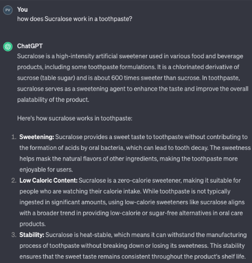

# Bootstrap starter

example code snippets from https://getbootstrap.com/docs/5.3/examples/

# content references
- https://www.peoples-progress-trust.org/
- https://www.pragathividyaniketan.com/

# online tools
#### pvnschoolcolab@gmail.com
https://chat.openai.com/

# Online tutorials
- Tables https://www.w3schools.com/html/html_tables.asp
- Lists https://www.w3schools.com/html/html_lists.asp
- Images https://www.w3schools.com/html/html_images.asp
- Links https://www.w3schools.com/html/html_links.asp
- CSS https://www.w3schools.com/html/html_css.asp 

# quiz 
- https://www.w3schools.com/html/html_quiz.asp

# Projects
Ingredient comparison table https://incidecoder.com/compare-products/himalaya-complete-care-toothpaste/sensodyne-toothpaste-gum-care 
Products:
- Toothpaste
- Soap
- Shampoo
- Dish soap
- Laundry detergent
- skin moisturizer
- Hair oil
- cooking oil

